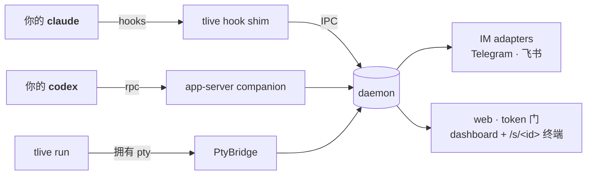

<div align="center">

# tlive

**厂商中立、自托管:给 `claude` / `codex` 的远程审批 + 实时监看层。**
在手机、飞书或 web 终端上批准工具调用、监看运行、接管打字。

[](https://www.npmjs.com/package/tlive)
[](https://github.com/y49/tlive/actions/workflows/ci.yml)
[](LICENSE)

[English](README.md) · [简体中文](README_CN.md)

</div>

> 你的 `claude` / `codex` 照常在终端里跑。tlive 借两家都支持的**开放 hook 机制**,
> 把状态(以及你开启后的审批卡)推到 **Telegram / 飞书**,并在你自己的机器上提供
> **web 仪表板 + 真实终端**——在任何设备上监看、回复续跑、发截图,甚至接管打字。
> **订阅还是 API key 都能用**,会话与数据永不离开你的机器。
>
> 开箱即用时 tlive **只监看 + 通知**(`mode: notify`,安全默认——它物理上无法
> 卡住任何工具调用)。想开**远程审批**——hold 住每个工具调用、让你在手机上
> 允许/拒绝——一条命令:**`tlive mode full`**(或让 `tlive setup` 帮你开)。

> [!WARNING]
> **v2.0 是彻底重写,breaking,无迁移。** tlive 不再是 v1.x 及更早的 Agent-SDK
> IM *桥接*:它不再驱动/拥有你的会话,旧的桥接模型、它的配置 schema、它的命令
> (`workspace`、`/use`、chat 绑定……)**均已删除、不再支持**。别把旧的
> `~/.tlive` 配置沿用过来——直接重跑 `tlive setup`。最后一个 SDK-桥接版本保留在
> git tag `v1.0-sdk-bridge`。

**跳转:** [快速开始](#30-秒跑起来) · [两档集成](#两档集成) · [功能一览](#功能一览) · [安装](#安装走插件不再手写配置) · [Codex companion](#codexapp-server-companion) · [安全模型](#安全模型) · [CLI](#cli) · [配置](#配置tliveconfigjson) · [架构](#架构)

## 30 秒跑起来

```bash
npm install -g tlive

tlive setup        # 向导:先用 Claude Code/Codex 自己的插件管理器注册 tlive
                    # 插件(hooks/skill//tlive:* 命令),再问 IM 凭据——也可以
                    # 整个跳过,进 Claude/Codex 里说"帮我配置 tlive"
tlive start        # 起 daemon —— 打印 web 地址 + 手机扫码二维码

tlive run claude   # (可选)包装会话 → 实时 web 终端 + 预览卡
```

扫一次码,dashboard 列出所有会话并实时串流每个 run。开启远程审批
(`tlive mode full`)后,工具调用需要审批时,IM 收到带 **允许 / 拒绝 /
总是允许** 按钮的卡片,web 卡片同步亮红。

## 两档集成

| | 只装 hooks(照常跑 `claude`/`codex`) | 包装(`tlive run claude`/`codex`) |
|---|---|---|
| 审批卡(IM + web) | ✅ | ✅ |
| IM 回复续跑 | ✅(续跑窗口内) | ✅ |
| dashboard 会话卡 | ✅ 状态 / 最后一句 | ✅ + 实时终端预览 |
| 真实 web 终端(xterm) | — | ✅ 多设备、手机键条 |
| IM 引用回复 → 打字进终端 | — | ✅ |
| IM 发图/文件 → agent | — | ✅(下载后注入路径) |
| web 粘贴/拖拽上传 | — | ✅ |

只装 hooks 永远可用,包装是纯加法。表里的**审批卡**那一行需要开着远程审批
(`tlive mode full`);默认的 `notify` 模式把其余全都做了——实时监看、
turn 结束 / 等待输入通知、回复续跑、web 终端——却绝不 hold 住任何工具调用。
IM 消息带 `label · ` 前缀(会话目录名),但不再用图标区分包装/仅 hooks——
续跑卡自带的"回复继续"提示已经让这个区分对你实际要做的事没有影响。

## 功能一览

- **姿态 —— `notify`(默认)/ `full` / `off`。** 一个坐在所有细旋钮之上的
  粗开关。**`notify`**(默认)只监看 + 通知,但 shim 物理上无法 hold 或
  阻塞任何审批——每个提示都保持 100% 原生(你本地终端的对话框,或无头时
  CC 自己的 auto-deny);提示在终端等你时仍会提醒(桌面通知、dashboard
  只读卡、grace 后的 IM 文本——只是指回终端的路标,绝不代答)。
  **`full`** 开启远程审批:tlive hold 住每个工具调用,
  让你在 IM / 桌面 / dashboard 上作答(即下方*审批*那条描述的一切)。
  **`off`** 让每个 hook 都成 no-op(kill switch——不 gating、不通知、不监看、
  不懒启动 daemon)。用 `tlive mode off|notify|full` 实时切换;shim 每个 hook
  都重读 config,无需重启也无需新会话,`tlive status` 会显示当前生效的 mode。
  远程审批设计成 opt-in——刚装好的工具绝不该能悄悄挂起你的工作流。
- **审批** *(远程审批 —— `mode: full`)* —— 需要审批的工具调用会被 hold 住,
  让你从 IM 按钮或 web 卡作答:
  - **并行、先答先得** —— Claude Code 上 `PermissionRequest` hook 与本地权限
    对话并行;两边都活,键盘上答掉后远程卡几秒内自动收尾("已在终端处理")。
    **绝不自动拒绝**——没人答时本地提示一直有效。
  - **发卡前静默** —— `approvals.approvalGraceSec`(默认 10 秒,`0` 关闭)先
    hold 住卡,键盘前马上答掉就压根不发;否则约 24 小时内可答。
  - **Codex** —— tlive 接管(adopt/spawn)一个 `codex app-server` companion,
    Codex TUI 自动连上;远程卡与原生提示同样竞速,没有窗口要配
    (见[安全模型](#安全模型))。
  - **渲染** —— diff/命令、高危模式标记、secret 打码。Telegram 卡片克制
    (标题粗体、按钮纯文字;唯一 emoji 是高危/错误上的 `⚠️`),长 diff 走
    expandable 折叠——用较新 Telegram 客户端渲染最佳。
  - **高危开关** —— **"总是允许 \<工具\>"** 按工具放行(内存态、重启清零;
    Claude Code 上远程替你点掉原生对话);`/trust on|off` 整体暂停审批。
  - **子代理默认透传** —— 后台/异步子代理没有并行本地框可兜底,所以 tlive
    返回 `{}` 交给 CC 原生处理;想连子代理也 hold 住等远程作答,设
    `approvals.holdSubagents: true`。
- **远程回答 `AskUserQuestion`(仅 Claude Code)** —— CC 为自己的提问工具
  fire `PermissionRequest`;tlive 把它转成单选或多选卡(复选框、实时
  `Submit (N)` 计数、`Skip`)而非 Allow/Deny,IM 和 dashboard 会话卡都能答。
  一次调用带多个问题时逐题走:卡标题显示 `Question 2/3`,`← Back` 可重答
  上一题,答完最后一题才整批回传。cursor 归 daemon 所有,所以在手机上答一题,
  dashboard 的卡也跟着推进。
  本地问题框依旧并行渲染且永远
  赢下竞速——键盘前给出的答案绝不会被覆盖;`Skip` 只是放行该工具,让你在
  本地答,不是自动批准任何操作。Codex 无此概念。
- **续跑** —— `Stop` 时回复 IM 消息(或 web 回复框),会话继续。摘录进
  折叠态的 expandable 引用块(标题、列表、表格、代码在展开后都完整保留,
  绝不从词中间或代码块中间截断);该卡还挂着时,60 秒后的"等待输入"空闲
  提醒会被抑制,不会在同一件事上再叠一条消息。
- **daemon 懒启动** —— 仅装 hooks 的会话不再需要先手动 `tlive start`:
  `SessionStart` 时 shim(以及 `tlive run` 启动时)检测到 daemon 未运行,会
  自动 detached 拉起(不阻塞会话)。`daemon.autoStart: false` 可关闭;
  `tlive start` 手动启动语义不变。
- **失败告警(仅 Claude Code)** —— `PostToolUseFailure`(工具调用失败)与
  `StopFailure`(会话级错误,如 rate-limit/billing)会推一条 `⚠️` 前缀的
  IM 消息。纯旁路,不影响任何审批决策;Codex 没有对应 hook,只对 Claude
  Code 生效。
- **会话内欢迎提示(仅 Claude Code)** —— IM 还没配置时,`SessionStart` 会往
  会话上下文里注入一句提示,引导你说"帮我配置 tlive";配置好之后就不再出现。
  Codex 不注入。
- **web 终端** —— `tlive run <cmd>` 在 `/s/<id>` 提供 pty:xterm.js、多设备
  **last-input 布局权**(谁打字网格归谁,其他端等比缩放)、晚到客户端全屏重建、
  软键盘感知布局、触屏查看/输入双模式、可拖动可收起的快捷键条
  (Esc/Tab/⇧Tab/Ctrl-C/…)、字号调节、复制屏幕弹层。
- **dashboard** —— `/` 列出会话:状态徽章、"卡住 Nm"、最后一句、着色审批卡、
  实时终端预览、per-session 静音、📎 上传、回复框。
- **给 agent 喂任何东西** —— IM 引用回复文本、IM 图片/文件、终端页粘贴/拖拽、
  dashboard 📎。统一落 `~/.tlive/inbox`(自动清理:48 小时 / 256MB 总量),
  以 bracketed paste 打进 pty。

## 安装:走插件,不再手写配置

`tlive setup`(以及 `tlive setup --hooks-only`)不再手改
`~/.claude/settings.json` / `~/.codex/hooks.json`,而是调用**各家自己的
插件管理器**:

- Claude Code:`claude plugin marketplace add <内置目录>` 再
  `claude plugin install tlive@tlive --scope user`。
- Codex(`codex` 在 `PATH` 上时):`codex plugin marketplace add <内置目录>`
  再 `codex plugin add tlive@tlive`。

Claude Code 插件里打包了 9 个 hook 事件、一个 `tlive` skill(用法/诊断/
安全模型,挂在 `/tlive:*` 命名空间下)、以及 `/tlive:url`、`/tlive:status`
两个 slash 命令。Codex 插件只带 skill——Codex 没有 hook 也不需要,它的集成
方式是 app-server companion(见下文)。厂商会把插件
**复制**进自己的 cache(Claude Code 是 `~/.claude/plugins/cache`,Codex 是
`$CODEX_HOME/plugins/cache/tlive/tlive/local/`)——升级 `tlive` 本体之后,
重跑一次 `tlive setup --hooks-only` 刷新这份拷贝。

用过早期直写 hooks 的开发版?请手动删一次旧条目(否则会双发)——见
[docs/manual-hooks.md](docs/manual-hooks.md) 附录。tlive 本身不再改动你的
厂商配置文件。

**老版本厂商没有插件 CLI**:`tlive setup` 会检测到(`claude plugin list` /
`codex plugin marketplace add` 失败)并打印指向手动配置附录的提示:
[docs/manual-hooks.md](docs/manual-hooks.md)——完整的 `settings.json`
hooks 块和 `hooks.json`,可以直接拷进去。

卸载(`npm uninstall -g tlive`)会尽力用各家 CLI 卸掉插件,并清理残留的旧
直写 hooks;`~/.tlive` 下的配置和日志保留。完整清理以及**从 v0.x/v1 迁移**
的步骤见 [docs/uninstall.md](docs/uninstall.md)。

**先从 GitHub 直接尝鲜**(不用等 npm 发布插件):`claude plugin marketplace
add y49/tlive` 再 `claude plugin install tlive@tlive`,直接从仓库根的
`marketplace.json` 拉插件(hooks/skill/命令)。引擎本体还是要装:
`npm i -g tlive`——daemon/CLI 靠它,hooks 调它。

`tlive setup` 在同时检测到 `claude` 和 `codex` 都在 `PATH` 上时会问**装到
哪**:`[1] Claude Code [2] Codex [3] 都装(默认)`。插件注册永远先于 IM 凭据
询问,IM 这步可以整段跳过——直接回车过掉,之后在 Claude Code 或 Codex 里说
"帮我配置 tlive"(Claude Code 里也可直接跑 `/tlive:setup`;Codex 无斜杠命令,
说那句话即可),AI 会交互式带你配完。

## Codex:app-server companion

Codex 没有 hook、也没有信任这一步——上面 Claude 那套 hooks/trust 流程完全
不适用。tlive 改为接管一个 `codex app-server --listen unix://…` 进程:
如果 tlive 的 socket 路径上已经有一个在监听就直接 adopt,没有就自己 spawn
并托管(带 respawn/backoff)。你跑的任何 `codex` TUI 都会**自动连上**那个
socket——这是 Codex 自身的特性,不是 tlive 每次会话去配置的。

在那条 RPC 连接上,tlive 订阅 Codex 自己的 thread/turn 事件,并通过
`ServerRequest` 驱动审批:Codex 请求权限决策时,tlive 把同一个请求同时
广播给 IM/web 和原生 TUI 提示——**先答先得**,和 Claude Code 的并行通道
语义一致。没有窗口要配置:原生提示永远不会被 tlive 卡住,因此也没有什么
会超时。

如果 companion 连不上(没装 Codex、respawn 耗尽了 backoff、或者在
win32 上——`codex app-server` 那边还没接好),`tlive status` 会如实报告
(`codex: app-server companion unreachable — approvals local-only`),
Codex 照常走它自己的本地审批流——没有 IM/web 卡,不会崩,只是少了远程
通道。

## 为什么不用官方远程?

官方远程(Claude Remote Control / Codex 手机端 / Channels)有 tlive 正好补上的
结构性空白:

- **跨 agent** —— 一套配置同时管 Claude Code 和 Codex。
- **API-key 用户** —— 官方远程不支持;tlive 不关心你怎么认证。
- **自托管** —— 链路上没有厂商云;web 由单 token 把门。
- **飞书** —— 官方渠道不覆盖。

tlive 刻意**不做**"手机从零 vibe coding"——官方远程做得更好。tlive 是给你已经
在跑的会话做审批 / 监看 / 插话的那一层。

## 安全模型

- **web**:每个 HTTP/WS 请求都要 token(`~/.tlive/web-token`,0600)。默认绑
  `0.0.0.0` 方便手机走局域网——token 是门。想只留本机,设
  `web.bind: "127.0.0.1"`。**卡片永不携带 dashboard 链接。** 以前的深链
  本身就带着 token——等于完整会话控制权——发进 IM 就等于把它永久寄存在
  消息服务商的服务器上。想在局域网外访问就自己开(比如自建
  tailscale/HTTPS 反代);IM 是推送,web 需要你自己去拉。
- **IM 入站**:fail-closed。非配置 chat 的消息/按钮一律丢弃;群聊场景可加
  `allowedSenders` 按用户加固。
- **`/trust on` 与"总是允许"是高危开关**:会自动放行。两者皆内存态、daemon
  重启即清。优先用按工具放行而非 `/trust`。你自己 Claude 设置里的
  `permissions.deny` 永远赢——hook 无法越过它。
- **兜底是静默**:没配 chat、超时、daemon 没起 → hook 输出 `{}`,Claude 在
  本地终端照常提示,就像 tlive 不存在。
- **Codex 审批天然 fail-safe**——原生提示永远不会被 tlive 卡住(没有窗口,
  也就没有超时);companion 连不上时 Codex 就走自己的本地审批流,`tlive
  status` 会报告 `codex: app-server companion unreachable — approvals
  local-only`。companion 在线时,远程卡和原生提示同场竞速——先答先得,和
  Claude Code 的并行通道语义一致。

## CLI

```
tlive setup            向导 + 注册厂商插件(幂等);--hooks-only 只重装插件
tlive start | stop     daemon 生命周期(stop 幂等)
tlive status           健康态、当前生效 mode、web 地址 + 二维码、配置路径
tlive logs [-f]        看 daemon 日志
tlive run <cmd> …      包装进程:本地终端 + web 终端
tlive url              打印 dashboard 地址 + 二维码(全屏应用盖住 run banner 时用)
tlive mode off|notify|full   设置姿态(见"功能一览");下一个 hook 即生效
tlive hook <event>     hook shim(Claude Code 调用,不是给你用的;
                        Codex 没有 hook——见 app-server companion)
```

`setup`、`start`、`stop`、`status`、`logs`、`run`、`url`、`hook` 是冻结面
(由 `tests/contract/` 锁定);`mode` 与运行时开关 `mute | trust | safe`
(`on|off`)、`desktop`(`on|off`)是加法命令。

IM 命令:`/mute on|off`(静音 IM 通知)、`/trust on|off`(暂停审批——全部
自动放行)、`/safe on|off`(自动放行日常操作)、`/help`。在客户端命令菜单里
点一下裸命令,会回一组 on/off 按钮而不是报错。引用任意会话消息回复 =
打字进那个会话。

## 配置(`~/.tlive/config.json`)

<details>
<summary>完整带注释配置——所有字段可选,下为默认值</summary>

```jsonc
{
  // 姿态:"off" | "notify"(默认)| "full"(开远程审批)。
  // 也可用 `tlive mode …` 实时设置;未设 / 未知值都回落 notify。
  "mode": "notify",
  "adapters": {
    "telegram": { "token": "…", "chatIdAllowList": ["123"] },
    "feishu":   { "appId": "…", "appSecret": "…", "chatId": "oc_…" }
  },
  "web": {
    "enabled": true,          // 默认 true
    "bind": "0.0.0.0",        // 默认;只留本机用 127.0.0.1
    "port": 7681
  },
  "daemon": {
    "autoStart": true         // 默认 true;设 false 关闭 session-start 懒启动
  },
  "approvals": {
    // 远程审批窗口(秒),两家共用。远程通道与本地提示并行,窗口开长
    // 也不费事——超时不批也不拒,只是把你逼回键盘而已。
    "windowSec": 86200,       // 默认约 24 小时(同时是上限;最小 60)
    // 审批卡发出前的静默期——键盘前这段时间内答掉就永不发卡
    "approvalGraceSec": 10,   // 默认 10 秒,0 = 关闭
    // 审批卡发出时在 daemon 本机弹桌面通知(Linux notify-send)——后台命令
    // hook 挂起期间 CC 不弹本地框,这是"人在电脑前"指向手机卡/dashboard 的入口
    "desktopNotify": true,    // 默认 true;无 notify-send 时静默降级
    // 多少操作不发卡直接自动放行:
    //  "readonly"(默认)—— 只放行 Read/Glob/Grep,其余都问
    //  "safe"          —— 额外放行日常操作(非危险 Bash、非敏感路径的编辑);
    //                     危险操作(rm -rf/sudo/curl|sh/敏感路径写入…)、
    //                     MCP/未知工具、AskUserQuestion 仍然发卡
    // 用于自主/agent 驱动、没有本地框的场景减少卡量。可用 /safe on|off 实时切换。
    // 绝不越过危险地板——只有 /trust on 才会自动放行危险操作。
    "autoApprove": "readonly",
    // 是否连后台/异步子代理的审批也 hold 住等远程作答
    //(默认 false:子代理透传给 CC 原生处理)。仅在 mode: full 下有意义。
    "holdSubagents": false,
    // 一个被 hold 的审批在窗口超时、无人应答时怎么办:
    //  "defer"(默认)→ 透传 {}(回落 CC 原生);
    //  "deny"        → 带一句"已超时"的拒绝,好让 turn 结束、续跑卡改道 agent。
    // 绝不自动放行。
    "timeoutAction": "defer"
  },
  "allowedSenders": [{ "channel": "telegram", "userId": "42" }]  // 可选
}
```

</details>

## 使用技巧

- **会话保活**:tlive 有意不拥有会话——`tlive run` 随终端退出而结束。想要
  detach/reattach:`tmux new -s work tlive run claude`。tmux 管保活,tlive 管
  远程层。
- **手机上滚动**:查看模式下手指滑动会转成滚轮事件——全屏 TUI(claude)的
  对话区像桌面鼠标滚轮一样滚动。看完整历史用键条上的 `Ctrl-R`(transcript)。
- **如何感知被包裹?** 被包裹的进程环境里有 `TLIVE_SESSION=<id>`(类似
  `$TMUX`);`tlive run` 在包裹内拒绝嵌套。同一目录开多个包裹会话没问题——
  各自独立卡片,包裹内的 hook 流量经 `TLIVE_SESSION` 精确归属到对应卡。
- **Windows**:设计上支持(命名管道、ConPTY),但实测少于 Linux/macOS——
  欢迎提 issue。

## 架构



- **daemon 不拥有会话**:只撮合审批/续跑、fan-out pty 字节、服务 web。
- **冻结面**(由 `tests/contract/` 锁定的契约)见 [KERNEL.md](KERNEL.md)。

## 从 v1.0 升级

v1.0 用 Agent SDK 驱动会话;v2 转向 hook 层(见
[`docs/changelog-archive.md`](docs/changelog-archive.md))。Breaking、
无迁移:重跑 `tlive setup`。v1.0 保留在 git tag `v1.0-sdk-bridge`。

## 开发

```bash
git clone https://github.com/y49/tlive
cd tlive
pnpm install
npm run typecheck && npm test && npm run build
```

## 许可

MIT,见 [LICENSE](LICENSE)。欢迎提 issue 和 PR,开发环境见上面的[开发](#开发)一节。
